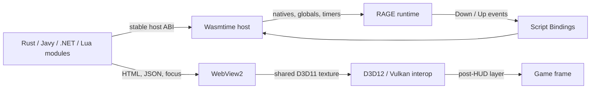

<div align="center">

# RDR2 Script Hook

**A native Windows runtime for sandboxed WebAssembly mods and GPU-composited WebView2 interfaces in Red Dead Redemption 2.**

[](https://github.com/emcifuntik/rdr2scripthook/actions/workflows/build.yml)
[](#compatibility)
[](CMakeLists.txt)
[](LICENSE)

</div>

RDR2 Script Hook loads isolated Rust, JavaScript, C#, and Lua WebAssembly mods, exposes a
typed scripting API, and renders interactive browser interfaces directly in the
game's post-HUD render path. It includes a launcher, in-process runtime, guest
SDK, native-code generator, example trainers, and a headless integration-test
host.

> [!IMPORTANT]
> This is an experimental modding and engine-research project. The current
> integration targets RDR2 build `1.0.1491.50` and may require updates for a
> different executable layout. Use it only where modding is permitted. This
> project is not affiliated with or endorsed by Rockstar Games.

## Highlights

- Wasmtime-based mod isolation with ABI validation, memory limits, and per-call
  execution fuel.
- Typed Rust wrappers generated from the RDR3 native database, plus globals,
  timers, logging, metadata, and frame/key events.
- Rust, JavaScript/Javy, C# NativeAOT-LLVM, and Lua guest profiles, all
  executed by the same embedded Wasmtime runtime.
- Transparent WebView2 overlays composed after the game HUD without CPU texture
  readback.
- Synchronized shared-texture paths for both Direct3D 12 and Vulkan.
- Overlay visibility, focus, native game cursor control, and bidirectional JSON
  messaging.
- A first-class **Script Bindings** section in the game's Controls screen with
  primary/alternate keys, persistence, press/release events, and up to 2048
  declared actions.
- Structured logging, full-memory minidumps, and a standalone WASM smoke-test
  executable.

## Architecture



The game-facing hooks, browser controller, and WASM host remain separate. Mods
only communicate through the versioned host ABI; they never receive direct
access to WebView2 or renderer COM objects.

## Compatibility

| Component | Current support |
| --- | --- |
| Operating system | Windows x64 |
| Game | Red Dead Redemption 2, executable layout `1.0.1491.50` |
| Graphics APIs | Direct3D 12 and Vulkan |
| Guest runtimes | Rust, Javy, .NET NativeAOT-LLVM, and Lua; Wasmtime only |
| Browser UI | Microsoft Edge WebView2 Runtime |
| Native toolchain | Visual Studio Build Tools, CMake, Ninja, `clang-cl` |

Graphics interop and RAGE hooks require live in-game testing. The headless test
suite covers the host ABI, native marshalling, WebView imports, all four guest
profiles, and repeated ticks.

## Build

Install Visual Studio C++ Build Tools, CMake 3.21+, Ninja, Python 3, Git, Rust,
.NET SDK 10, and PowerShell. Run the following from a Visual Studio developer PowerShell:

```powershell
git clone --recurse-submodules https://github.com/emcifuntik/rdr2scripthook.git
Set-Location rdr2scripthook

.\vcpkg\bootstrap-vcpkg.bat -disableMetrics
rustup target add wasm32-unknown-unknown wasm32-wasip1

cmake --preset windows-release
cmake --build --preset windows-release
& .\BIN\Release\wasmtest.exe
```

Build the bundled JavaScript example separately when needed:

```powershell
.\scripts\javy-wasm\build.ps1
.\scripts\dotnet-wasm\build.ps1
.\scripts\lua-wasm\verify.ps1
```

Release output is written to `BIN/Release`. Keep `launcher.exe`,
`launcher-hook.dll`, `rdrhook.dll`, `crossmap.dat`, and the `mods/` directory
together. Start `launcher.exe`; pass `nolaunch` when the Rockstar launcher or
the game is already being started separately.

Every push and pull request also runs the Windows Release build and smoke tests
in GitHub Actions. Successful runs publish a ready-to-extract runtime artifact
for 14 days. Pushing a stable semantic-version tag such as `v1.2.3` runs the
same verified build and publishes a GitHub Release containing a versioned ZIP
and its SHA-256 checksum.

## Create a mod

The loader discovers `mods/<directory>/mod.toml`. A minimal manifest with a
binding visible in the game's Controls settings looks like this:

```toml
[mod]
name = "Example Mod"
version = "1.0.0"
author = "Author"
description = "Example description"
entrypoint = "main.wasm"
runtime = "wasmtime"

[[input.bindings]]
id = "open_inventory"
description = "Open custom inventory"
mapper = "keyboard"
default = "F6"
```

The primary key comes from the manifest. Users can assign both the primary and
alternate slots from the in-game Controls screen; both mappings feed the same
`Down`/`Up` event stream.

Rust guests use `scripts/rdr2-wasm` as a path dependency and build as a
`cdylib` for `wasm32-unknown-unknown`:

```rust
use rdr2_wasm::input::{self, BindingEvent};

fn initialize() {
    let binding = input::Binding::register_keyboard(
        "open_inventory",
        "Open custom inventory",
        "F6",
    ).expect("register binding");

    rdr2_wasm::event::add_tick_callback(move || {
        while let Ok(Some(event)) = binding.poll_event() {
            match event {
                BindingEvent::Down => rdr2_wasm::log::info("inventory opened"),
                BindingEvent::Up => rdr2_wasm::log::info("inventory key released"),
            }
        }
    });
}

rdr2_wasm::entrypoint!(initialize);
```

For an end-to-end implementation, see the Rust WebView trainer in
[`scripts/example-wasm`](scripts/example-wasm) or the JavaScript trainer in
[`scripts/javy-wasm`](scripts/javy-wasm). The C# AOT SDK and example live in
[`scripts/dotnet-wasm`](scripts/dotnet-wasm); the synchronized Lua artifact
and lifecycle example live in [`scripts/lua-wasm`](scripts/lua-wasm).

## Repository layout

| Path | Purpose |
| --- | --- |
| `launcher/` | Starts or attaches to RDR2 and injects the runtime. |
| `launcher-hook/` | Holds a newly created game process until injection completes. |
| `rdrhook/` | RAGE integration, WASM host, input system, and WebView renderer. |
| `scripts/rdr2-wasm/` | Rust guest SDK and stable ABI wrappers. |
| `scripts/example-wasm/` | Rust WebView trainer with an F3 default binding. |
| `scripts/javy-wasm/` | JavaScript/Javy trainer with an F4 default binding. |
| `scripts/dotnet-wasm/` | C# SDK and NativeAOT-LLVM core-module example. |
| `scripts/lua-wasm/` | Lua artifact synchronization, ABI lock, and example. |
| `shared/static/mods/` | Bundled manifests and WASM modules copied into output. |
| `tools/codegen/` | RDR3 native-wrapper generator. |
| `wasmtest/` | Headless ABI and guest-runtime integration tests. |
| `research/` | Reverse-engineering and engine-integration notes. |

## Documentation

| Guide | Contents |
| --- | --- |
| [Building and testing](docs/building.md) | Toolchain, targets, examples, and verification. |
| [Runtime architecture](docs/architecture.md) | Process lifecycle, render paths, input, and ownership. |
| [WASM scripting API](docs/scripting.md) | Manifest format, guest profiles, bindings, and WebViews. |
| [WebView2 integration notes](research/webview2-integration.md) | Offscreen composition and graphics synchronization. |
| [Native key-binding notes](research/custom-key-bindings.md) | Controls-menu integration and persistence model. |

## License

Distributed under the [MIT License](LICENSE).
