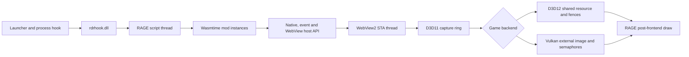

# Runtime architecture

## Overview

## Startup

The launcher injects a small process hook into the Rockstar launcher so a new
RDR2 process starts suspended. It then injects `rdrhook.dll` and resumes the
game. If RDR2 is already running, it injects the runtime directly.

The runtime initializes logging, predeclares manifest input bindings, runs its
engine hooks, discovers the active graphics backend, installs the post-frontend
renderer, and registers crash handling. The WASM runtime and mod instances are
created later from the RAGE script thread.

## Mod runtime

Each mod gets its own Wasmtime store and module instance. `wasmtime`, `javy`,
`dotnet`, and `lua` are guest ABI profiles; none introduces another execution
engine. The host enforces a
64 MiB linear-memory limit and replenishes a bounded fuel budget before each
export call. A failing tick export is disabled without preventing later mod
shutdown cleanup.

Before instantiation, every imported module is checked against the profile
allowlist. Plain Rust modules may import only `rdr2`. Javy, .NET, and Lua may
also import `wasi_snapshot_preview1`; their WASI context inherits no arguments,
environment variables, directories, or sockets. Standard streams are replaced
with host-owned logging callbacks.

Host resources are owned by the creating mod. Unload releases cursor
references and closes the singleton WebView when that mod owns it.

## WebView pipeline

`WebViewHost` owns WebView2 and Windows Graphics Capture on a dedicated STA
thread. It publishes immutable descriptors for the newest completed capture
surface. `WebViewOverlay` consumes these descriptors from the render callback;
`RageUiRenderer` imports each unique surface and records the textured UI draw.

On Direct3D 12, the game queue waits and signals shared D3D11 fence values. On
Vulkan, the runtime imports the same objects as external image memory and
semaphores. Vulkan waits and signals are staged into the game's own queue
submission thread so queue external synchronization is preserved.

Hiding an overlay stops drawing and returns input to the game but leaves the
browser and capture resources alive. Closing performs asynchronous browser
teardown and render-resource reset.

## Input

The game window procedure provides mouse and keyboard events. When WebView
focus is active, the runtime forwards compatible events to the composition
controller, suppresses corresponding game input, and requests RDR2's native
cursor. Cursor show/hide calls are reference-counted per mod and remaining
references are reclaimed on unload.

The binding manager samples RAGE's double-buffered 256-key keyboard snapshot
once per script tick, detects transitions, and queues independent Down/Up
events for each named action. Runtime ownership and queued state are released
when a mod unloads. Manifest-declared records remain reserved for the next load.
Overrides are written atomically to `input-bindings.toml`.

The native settings bridge prepends a `Script Bindings` category backed by a
parallel 2048-entry synthetic-ID array. RDR2 1.0.1491.50's retail registry owns
actions `0..784`; script row IDs `785..2832` are intercepted before retail code
can index its fixed arrays. Jitasm bridges extend the row builder's enabled mask,
isolate the retail conflict builder, and route lookup/remap operations for that
range to the script binding manager. A row-refresh hook keeps both of the game's
mapping widgets interactive. A mapping-expression bridge then appends the
corresponding primary or alternate key through RAGE's native keyboard-glyph
pipeline. Starting a remap temporarily retains one genuine retail keyboard
mapping as RAGE's capture sentinel, then
replaces only the capture identity with the supplemental control ID. The
captured key and its mapping index are committed through the binding manager,
so the sentinel mapping is never modified; no synthetic vtable or copied engine
state is required.

Hooks provide category entries, localized labels, current keyboard mappings,
name lookup, and persistent remap commits. Signature scans happen only during
DLL initialization and never from a game input callback.

RDR2 constructs and caches the Controls category widgets before the WASM
script thread starts. The host therefore reads `[[input.bindings]]` declarations
from mod manifests during DLL initialization and publishes those controls at
frontend startup. Later WASM registration adopts the matching reservation.
Runtime-only registrations are intentionally not inserted into cached RAGE UI
objects.

## Important thread boundaries

| Owner | Must own |
| --- | --- |
| Browser STA | WebView2 controllers, WinRT capture objects and browser commands. |
| Render thread | RAGE textures, graphics state and overlay draw recording. |
| Vulkan submission thread | Queue submission and imported semaphore waits/signals. |
| Script thread | Mod callbacks, input polling and public host operations. |

Do not block one owner while waiting for another. Browser commands are queued,
frames are immutable after publication, and render callbacks avoid guest-code
execution.
