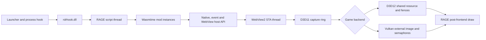

# Runtime architecture

## Overview

## Startup

The launcher injects a small process hook into the Rockstar launcher so a new
RDR2 process starts suspended. It then injects `rdrhook.dll` and resumes the
game. If RDR2 is already running, it injects the runtime directly.

The runtime initializes logging and hooks first, discovers the active graphics
backend, installs the post-frontend renderer, and registers crash handling.
The WASM runtime is created later from the RAGE script thread, which also scans
the output directory's `mods/` folders.

## Mod runtime

Each mod gets its own Wasmtime store and module instance. The host enforces a
64 MiB linear-memory limit and replenishes a bounded fuel budget before each
export call. A failing tick export is disabled without preventing later mod
shutdown cleanup.

Host resources are owned by the creating mod. Unload releases cursor
references and closes the singleton WebView when that mod owns it.

## WebView pipeline

`WebViewHost` owns WebView2 and Windows Graphics Capture on a dedicated STA
thread. It publishes immutable descriptors for the newest completed capture
surface. `WebViewOverlay` consumes these descriptors from the render callback;
`RageUiRenderer` imports each unique surface and records the textured UI draw.

On Direct3D 12, the game queue waits and signals shared D3D11 fence values. On
Vulkan, the runtime imports the same objects as external image memory and
semaphores. Vulkan waits and signals are staged into the game's own queue
submission thread so queue external synchronization is preserved.

Hiding an overlay stops drawing and returns input to the game but leaves the
browser and capture resources alive. Closing performs asynchronous browser
teardown and render-resource reset.

## Input

The game window procedure provides mouse and keyboard events. When WebView
focus is active, the runtime forwards compatible events to the composition
controller, suppresses corresponding game input, and requests RDR2's native
cursor. Cursor show/hide calls are reference-counted per mod and remaining
references are reclaimed on unload.

The current general key API polls 256 Win32 virtual-key states once per script
tick and dispatches down/up exports. Native, user-remappable RAGE bindings are
planned separately; see the key-binding research document.

## Important thread boundaries

| Owner | Must own |
| --- | --- |
| Browser STA | WebView2 controllers, WinRT capture objects and browser commands. |
| Render thread | RAGE textures, graphics state and overlay draw recording. |
| Vulkan submission thread | Queue submission and imported semaphore waits/signals. |
| Script thread | Mod callbacks, input polling and public host operations. |

Do not block one owner while waiting for another. Browser commands are queued,
frames are immutable after publication, and render callbacks avoid guest-code
execution.
